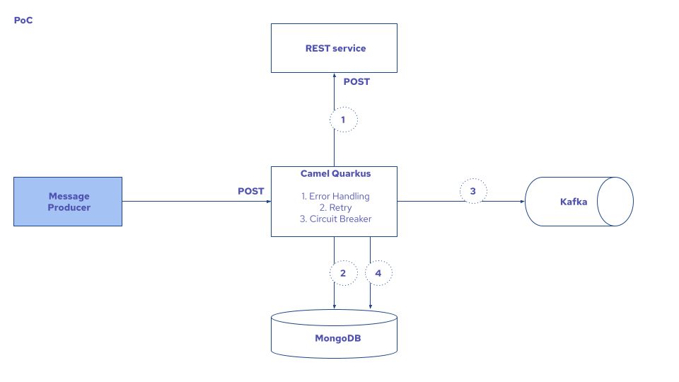

# Resilience Demo



## Local
### Prerequisites
Docker, Docker Compose and Java 11 installed

### Start services
Start docker-compose with Kaka and MongoDB
```bash
docker-compose up
```

Start Rest service
```bash
cd encryption
mvn clean quarkus:dev
```

Start Resilience service
```bash
cd resilience
mvn clean quarkus:dev
```

Call Resilience service
```bash
curl -X POST -H "Content-Type: application/json" --data '{"clientId":1,"amount":1000, "description":"some data"}' http://0.0.0.0:8081/event     
```

Try to stop/start rest/kafka/mongo services to see the reaction

## Cloud
### Prerequisites
OpenShift 4.8+ cluster up and running
Mongo Database in https://cloud.mongodb.com
Java 11 installed locally

### Deploy services
Login
```bash
oc login --token=$YOUR_TOKEN --server=$YOUR_SERVER             
```

Deploy AQM Streams operator and install kafka instance
```bash
oc apply -k openshift         
```

Deploy and start Rest service
```bash
cd encryption
oc project resilience
./mvnw clean package -Dquarkus.kubernetes.deploy=true
```

Configure Resilience service to use proper MongoDB in `resilience/src/main/resources/application.properties`
```
quarkus.mongodb.connection-string=mongodb+srv://$USER:$PASSWORD@$URL/test
```

Deploy and start Resilience service
```bash
cd resilience
oc project resilience
./mvnw clean package -Dquarkus.kubernetes.deploy=true
```

Call Resilience service
```bash
curl -X POST -H "Content-Type: application/json" --data '{"clientId":1,"amount":1000, "description":"some data"}' http://$YOUR_SERVER/event     
```

Try to stop/start rest/kafka/mongo services to see the reaction